# Dumping Psion 5mx PRO BootLoader

  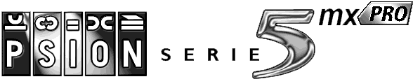

The Psion 5mx PRO has no embedded OS in the Mask ROM, unlike other machines. It has only a small (128 KB) BootLoader chip.  
It's an AT29LV010A Flash, attached to the CS7 signal.

<table align="center">
  <tr>
    <td>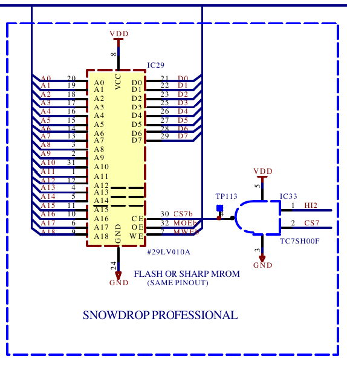</td>
    <td>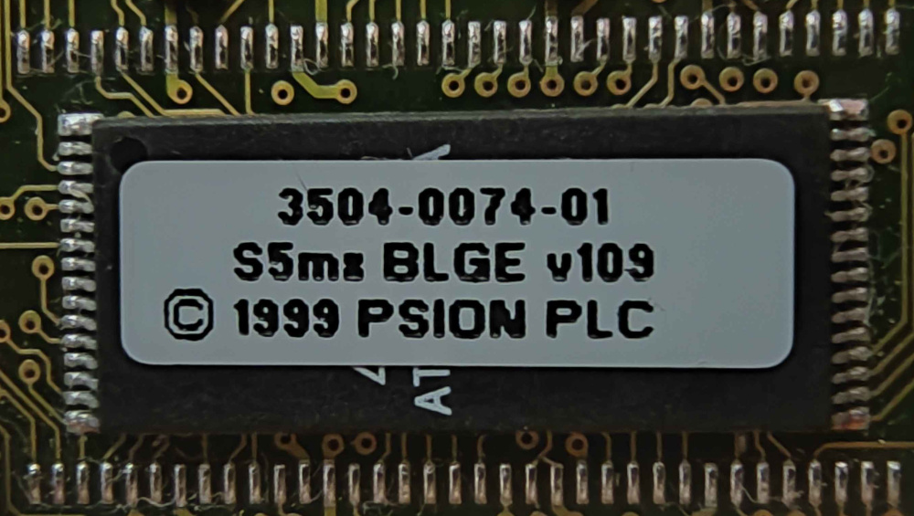</td>
  </tr>
</table>

Normally, the device at CS7 is mapped to address 0x70000000, but in PRO, unlike other 5mx machines, MCU (Windermere) runs in Alternate Test ROM (yep, Test!).

<table align="center">
  <tr>
    <td>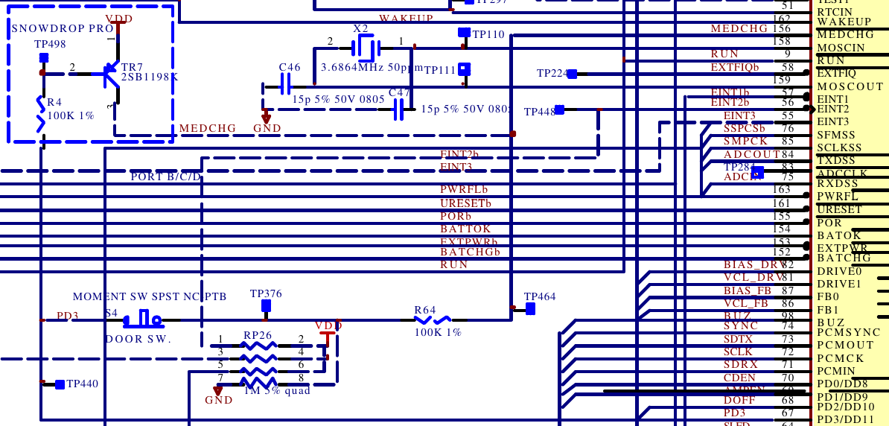</td>
    <td>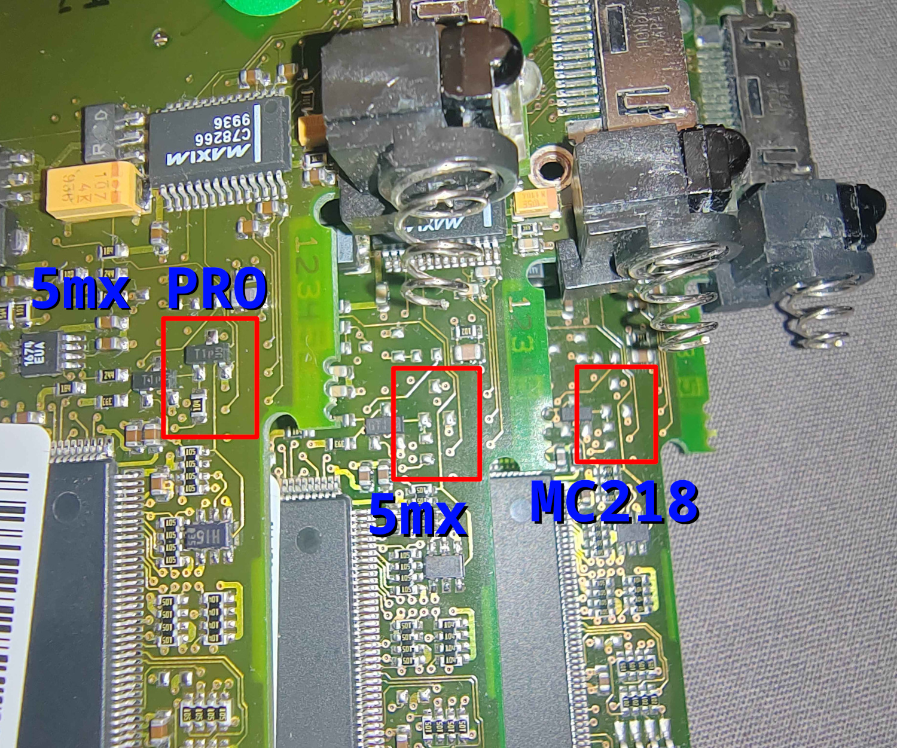</td>
  </tr>
</table>

So this actually reverses the address mapping for all devices (ETNA and PCMCIA interface too), and now BL Flash is at 0x00000000, and the machine can boot from it.  
(There is no Windermere documentation, but CL-PS7110 (used in Series 5) has a similar mode).

  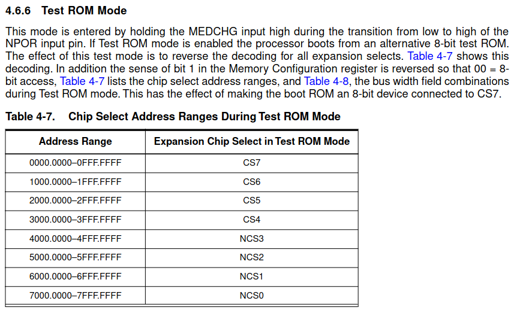

Normally, there is no access to the BootLoader chip from the OS, as it's not MMU-mapped.  
A [special version](sys$rom.bin) of the standard 5mx PRO OS (Build 319) is modified to be able to dump this BootLoader Flash chip.

  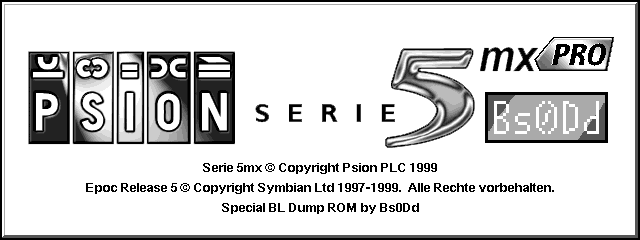

If you have a machine with BootLoader different than **"S5mx BLGE v109"** (check the sticker on the chip); please dump it using the following steps:

1. Run ***PsiROMx*** (embedded);  
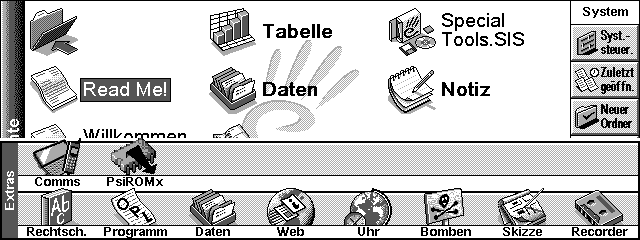

2. Open ***Advanced options***;
3. Set ***Start address*** at **51200000**;
4. Set ***Size (KB)*** to **128**, ***End address*** must be at **51220000**;  
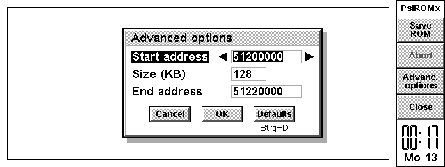

5. Select ***Save ROM***, set name (for example: **sys$bl.bin**);  
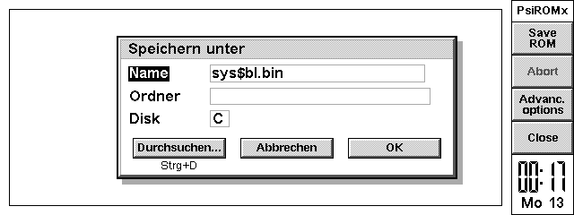

6. Wait until dumping is done;  
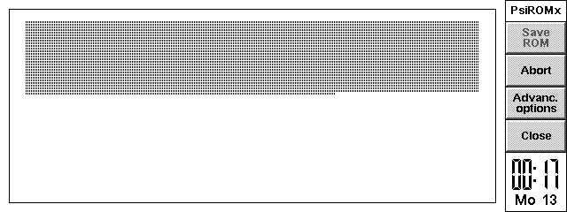 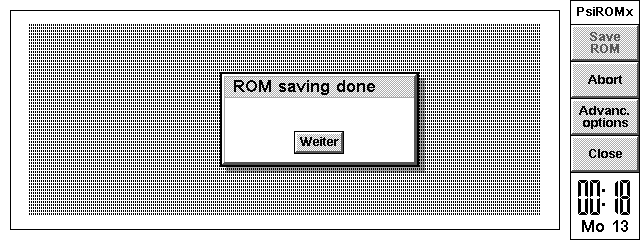

7. Check the file size, it must be **128 KB** or **131072 Bytes**;  
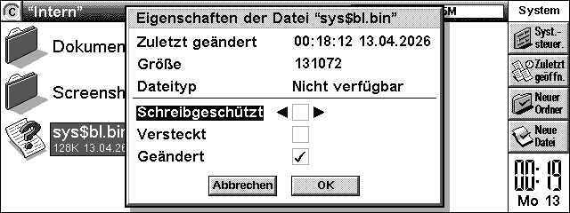

8. If all is ok, offer your file to this repository.

 

You can also dump your **EEPROM** (128 Bytes). Unpack additional software by installing **Special Tools.SIS**, then run **Show EEPROM.exe** (at **C:\\**) to list your EEPROM's contents to the screen.
Take a photo or make an MBM screenshot (**Shift + Ctrl + Fn + S**) and offer it to [bs0dd@bs0dd.net](<mailto:bs0dd@bs0dd.net?subject=Psion 5mx PRO EEPROM>).

  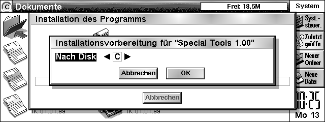
  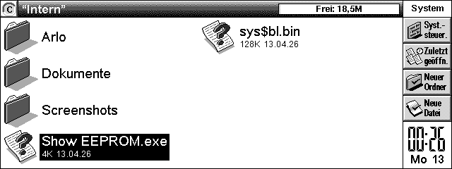
  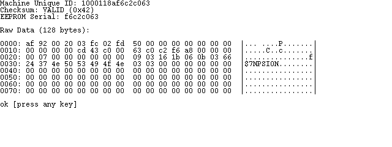

***For advanced users***: there is also an **ARLO** tool (Linux loader for Psions) in the Special Tools pack. It's not configured to run Linux, but it's included due to the advanced and expert modes functionality. You can use it for reading and researching some memory sections. **Enjoy!**

------------------------------------------
**2026 © Bs0Dd [[bs0dd.net](http://bs0dd.net)]**
