# Dumping Psion netBook BootLoader

  

The Psion netBook has no embedded OS, like 5mx PRO. It has a 2 MB BootLoader chip on it's Personality module.  
It's a Flash chip (may be Sharp or Intel), attached to the CS0 signal (so available at 0x00000000).

  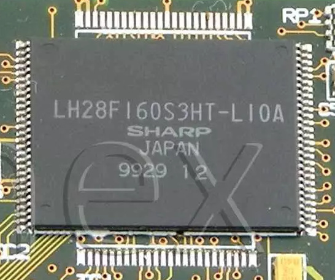

Normally, there is no access to the BootLoader chip from the OS, as it's not MMU-mapped.  
A [special version](OS.IMG) of the standard netbook OS (Build 450) is modified to be able to dump this BootLoader Flash chip.

  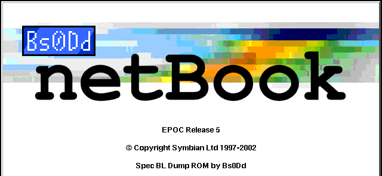

The BootLoader version can be seen when it's **idle** (waiting for a CF or YMODEM transmission).

  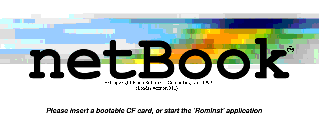

If you have a machine with a BootLoader different from those listed [here](/README.md#psion-netbook),
please dump it using the following steps:

1. Run ***PsiROMx*** (embedded);  
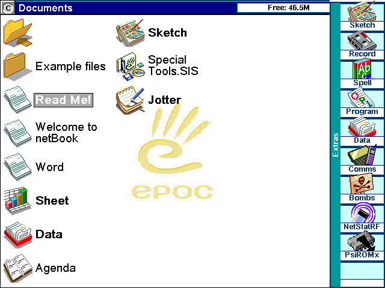

2. Open ***Advanced options***;
3. Set ***Start address*** at **51200000**;
4. Set ***Size (KB)*** to **2048**, ***End address*** must be at **51400000**;  
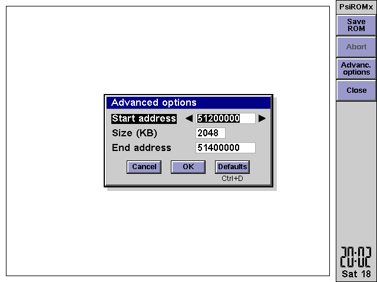

5. Select ***Save ROM***, set name (for example: **sys$bl.bin**);  
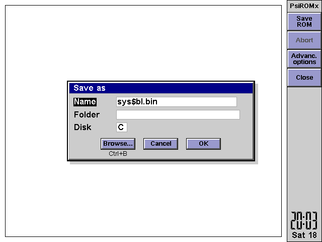

6. Wait until dumping is done;  
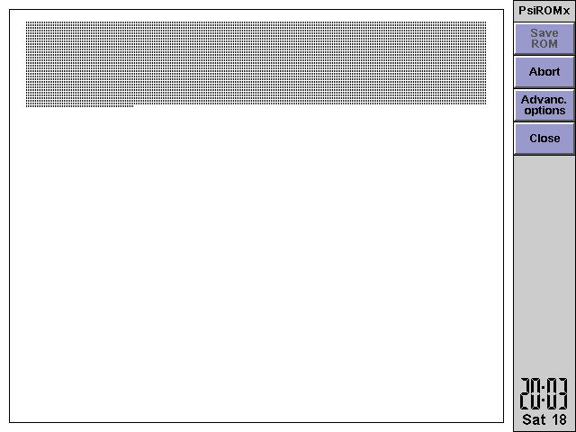 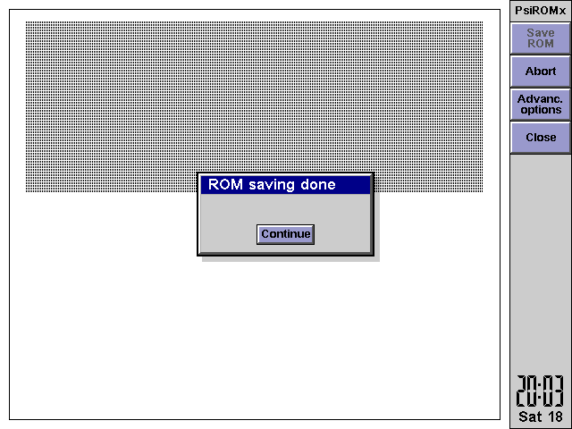

7. Check the file size, it must be **2 MB** or **2097152 Bytes**;  
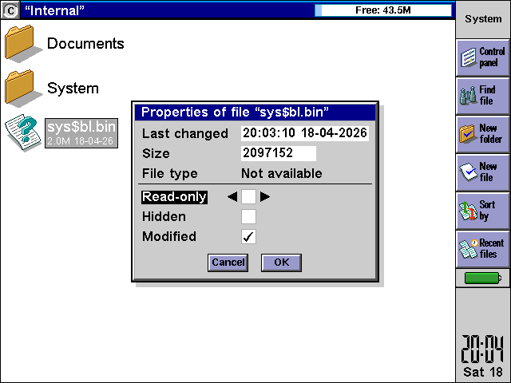

8. If all is ok, offer your file to this repository.

 

You can also dump your **EEPROM** (128 Bytes). Unpack additional software by installing **Special Tools.SIS**, then run **Show EEPROM.exe** (at **C:\\**) to list your EEPROM's contents to the screen.
Take a photo or make an MBM screenshot (**Shift + Ctrl + Fn + S**) and offer it to [bs0dd@bs0dd.net](<mailto:bs0dd@bs0dd.net?subject=Psion 5mx PRO EEPROM>).

  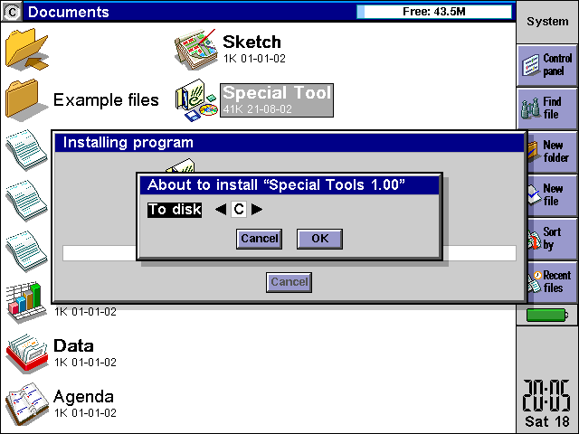
  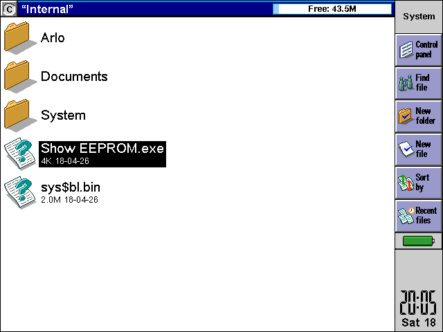
  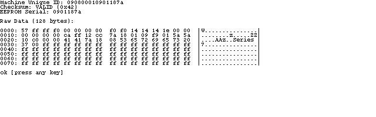

***For advanced users***: there is also an **ARLO** tool (Linux loader for Psions) in the Special Tools pack. It's not configured to run Linux, but it's included due to the advanced and expert modes functionality. You can use it for reading and researching some memory sections. **Enjoy!**

------------------------------------------
**2026 © Bs0Dd [[bs0dd.net](http://bs0dd.net)]**
